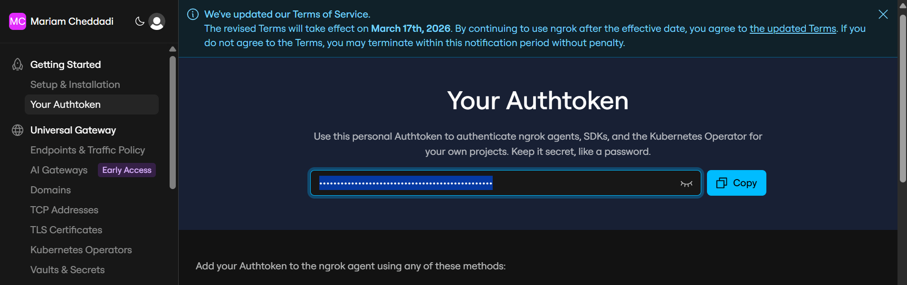
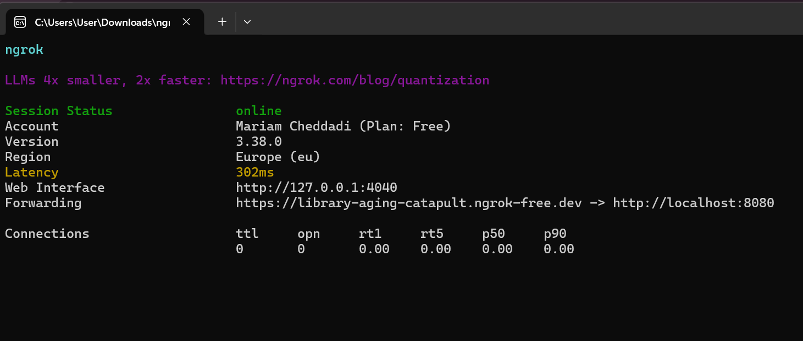
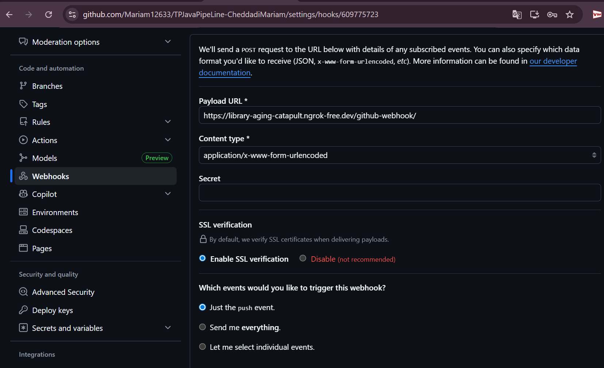
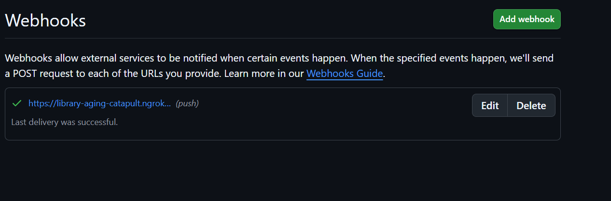
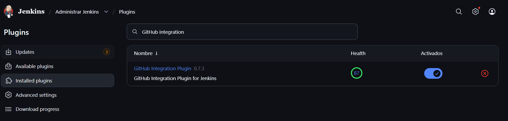
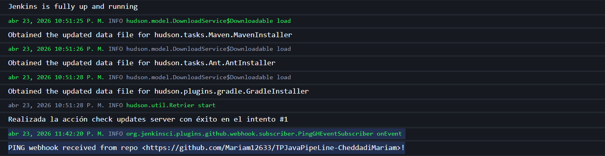
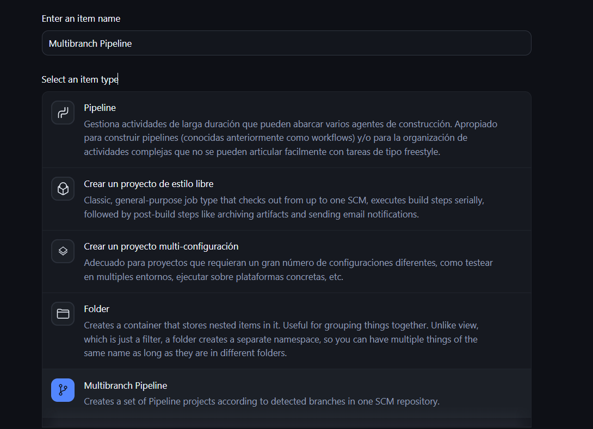
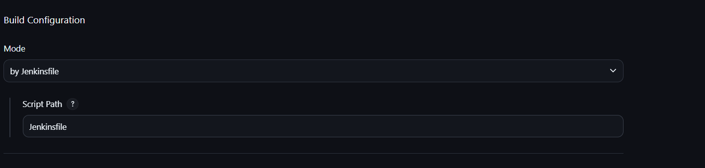
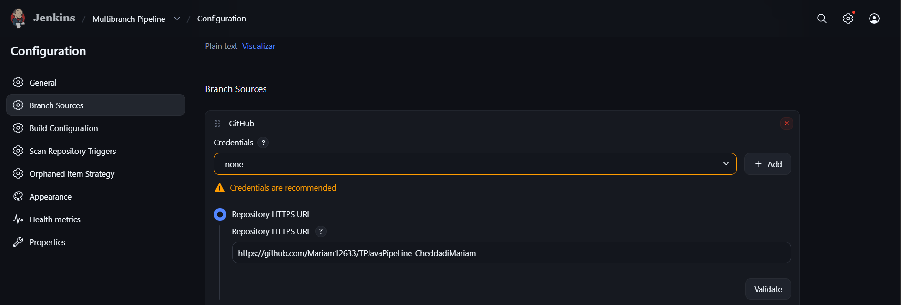
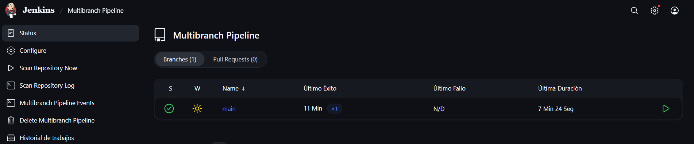

## 📸 Captures d'exécution

### ✅ Authentification via ngrok

### ✅ Lien de Redirection

### ✅ Création de webhook sur github

### ✅ Vérifie le mapping dans GitHub

### ✅Installation de pluging Github Integration

### ✅ Vérifier le Listener côté Jenkins

### ✅ Creation d'un Multibranch PipeLine

### ✅ Configuration du Multibranch PipeLine

### Resultat 

---

